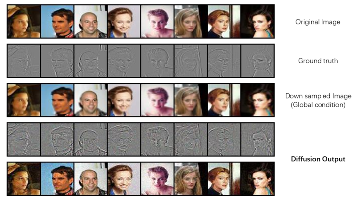

# PyramidDiffusionModel
An idea about the hierarchical architecture of diffusion model and parallel diffusion model. Trying to improve the performance and inference speed.
Some links: <br>
[Online Power Point](https://docs.google.com/presentation/d/1qXofri993GIFBN_N588b9cWaIepcYvAI/editusp=sharing&ouid=104029861800212191327&rtpof=true&sd=true)<br>
[Overleaf](https://www.overleaf.com/project/66182683eb7dc1d8f59125b1)<br>


## Introduction
This project try to use hierarchical structure to further exploit the capability of traditional diffusion models. Idea is to divide the image into different bands, like in fourier transformation, and then applies diffusors to each level.
## Installation
The requirment file is provided, to install the environment use the command:
```
conda env create -f requirements.yml
```
## Training


## Inferencing

## Evaluation
To calculate the FID score, we use the implementation [here](https://github.com/alsdudrla10/DG/tree/main) with some modifications. First you will need the generate some samples via `sample.py`, recomend number is 50000. 
After that download the statistic of the refernce from [here](https://drive.google.com/drive/folders/1gb68C13-QOt8yA6ZnnS6G5pVIlPO7j_y) for CIFAR or [here](https://github.com/openai/guided-diffusion/tree/main/evaluations) for ImageNet and place it in the folder:
```
$projects/PyramidDiffusionModel/
├── PDM
│   ├── static
│   │   └── cifar10-32x32.npz
```
Then use the following command the do the evaluation:
```
python fid_npzs.py --images /samples --ref /static/cifar10-32x32.npz --num_samples <num_samples>
```
And for capture the FLOPs, we used the package `PyProf`. Details instruction can be found [here](https://github.com/NVIDIA/PyProf/blob/main/docs/profile.rst)

## TODO
