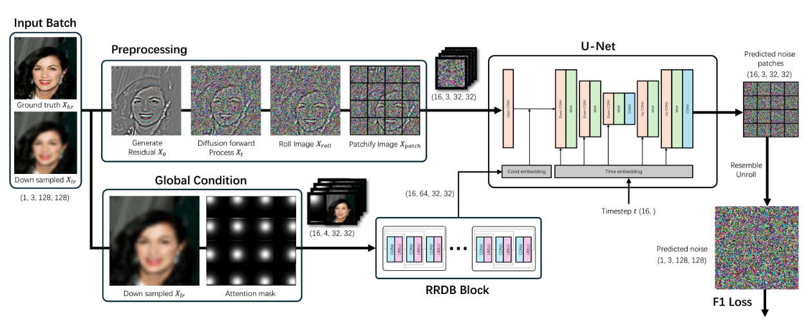

# Swin Parallel Diffusion

Links for powerpoint: [Online Power Point](https://docs.google.com/presentation/d/1qXofri993GIFBN_N588b9cWaIepcYvAI/editusp=sharing&ouid=104029861800212191327&rtpof=true&sd=true)<br>

## Introduction
The project aims to accelerate diffusion model inference for image synthesis and super-resolution tasks by dividing the original image into patches and processing them with independent diffusion kernels. 
We propose a series of methods to mitigate the artifacts introduced by this patch-based approach and test the results on datasets such as CIFAR and CelebA using traditional super-resolution tasks.

## Installation
The requirment file is provided, to install the environment use the command:
```
conda env create -f requirements.yml
```
## Prepare Dataset
The CIFAR dataset can be obtained easily with pytorch.
And for CelebA dataset, please first download the raw files from [CelebA dataset](https://mmlab.ie.cuhk.edu.hk/projects/CelebA.html) (in this case we only need the `img/img_align_celeba.zip`), unzip and put the file in directory `./dataset/CelebA` and run the imresize code with:
```
python ./PDM/data_utils/imresize_dataset.py --size <the size you want>
```
The result can be found in `./datasets/celeba/resize_<size>`.
## Training

The basic configuration can be found in `PDM/config`. Run the training code with simply:
```
cd PDM
python train.py
```
Since the training won't take a huge amount of time even on bad GPU, the checkpoints won't be online available. <br>
Multi GPU training is also possible with resetting the `ngpu` parameter. 

## Inferencing
Inferencing is also simple with command:
```
cd PDM
python sample.py
```
The enabling and disabling fid and other metrics can be fount in config.
## Evaluation
To calculate the FID score, we use the implementation [here](https://github.com/alsdudrla10/DG/tree/main) with some modifications. First you will need the generate some samples via `sample.py`, recomend number is 50000. 
After that download the statistic of the refernce from [here](https://drive.google.com/drive/folders/1gb68C13-QOt8yA6ZnnS6G5pVIlPO7j_y) for CIFAR or [here](https://github.com/openai/guided-diffusion/tree/main/evaluations) for ImageNet and place it in the folder:
```
$projects/PyramidDiffusionModel/
├── PDM
│   ├── static
│   │   └── cifar10-32x32.npz
```
Then use the following command the do the evaluation:
```
python fid_npzs.py --images /samples --ref /static/cifar10-32x32.npz --num_samples <num_samples>
```
And for capture the FLOPs, we used the package `PyProf`. Details instruction can be found [here](https://github.com/NVIDIA/PyProf/blob/main/docs/profile.rst)

For SR task, the metrics originate from the [SRDiff](https://github.com/LeiaLi/SRDiff) implementation.
## TODO
1. Testing FLOPS
2. Continue with DWT
